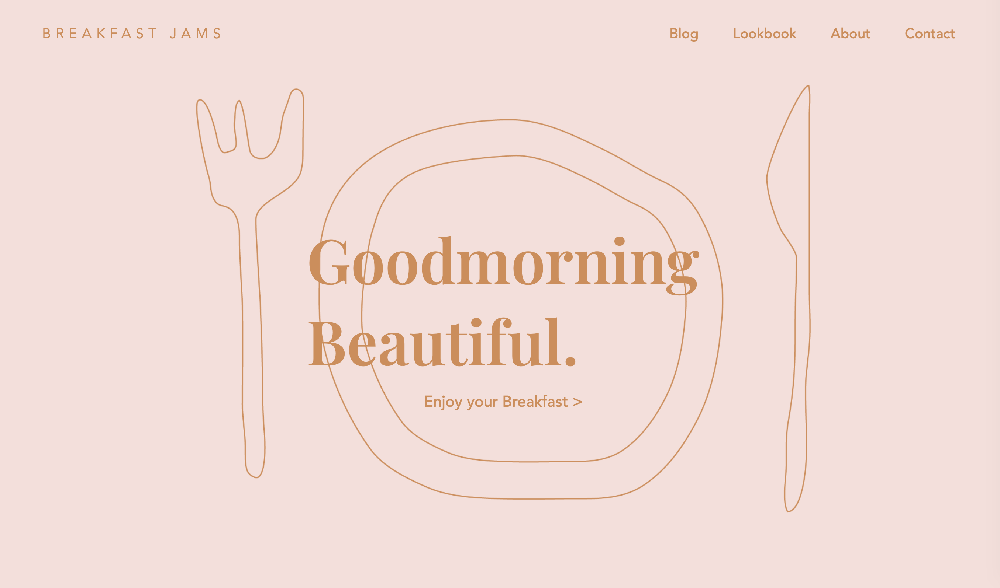
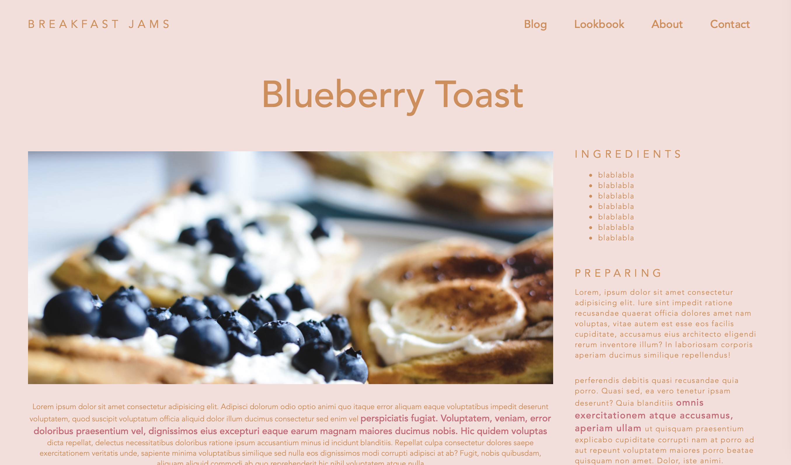

# foodBlog

## 💬 Project Goal

The goal of this project is design a basic food-blog website.

## 💬 Tools 

CSS, HTML

## 💬 Requirements

* design a landing page
* design a blog overview page
* design a post page

## 🚀 Preview

https://foodblog-htmlcss.netlify.app/html/post.html

ENJOY!

